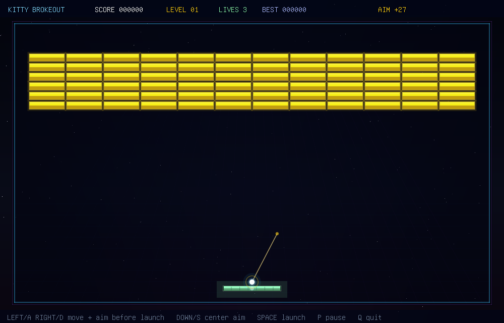

# Kilix Brokeout

A native C Breakout/Arkanoid-style game rendered as real pixels through the
kitty graphics protocol. No SDL, no X11, no ncurses: the game renders a
software RGBA framebuffer, compresses it with zlib, and streams it to the
terminal as kitty image frames.



The executable remains `kitty-brokeout` for compatibility with existing Kilix
installations and scripts.

The game has a responsive playfield, multi-hit bricks, metal bricks, explosive
bricks, speed bricks, falling capsules, particles, ball trails, screen shake,
level progression, a locally generated sound bank with procedural fallback,
and headless test modes.

## Features

- Kitty-protocol pixel graphics with double-buffered terminal frames
- Exact held-key movement with independent press/release tracking and a
  press-only compatibility fallback
- Fixed-timestep gameplay with substepped ball collisions
- Multi-hit, metal, explosive, and speed bricks
- Wide paddle, slow, multiball, and shield capsules
- Aimed launch with a visible guide line
- Persistent local best score
- Particles, ball trails, screen flash, and screen shake
- Nine reviewed local SFX with a safe procedural fallback, played through
  `pacat`, `pw-play`, `aplay`, or sox `play`
- Deterministic selftests and render tests for CI
- **Neural player** - a 2,601-parameter network trained in the game's own
  simulation chooses where on the paddle to strike each ball, and learned to
  tunnel through to the top. On 4,000 held-out levels it clears 14.9% of them
  cleanly within three minutes, where the scripted autopilot clears 0.4%, and
  it removes 85% of the bricks (autopilot: 25%). Pick it on the menu to watch;
  press N to take the paddle, and N again to hand it back
- **Menus** - main (start, player, controls, sound, quit), pause (resume,
  restart, main menu, quit) and game over (play again, main menu, quit)

## Build

Linux only. Needs gcc or clang, zlib, libm, pthreads, and a terminal that
supports the kitty graphics protocol:

```sh
make
./kitty-brokeout
```

Sound uses the first available sink among `pacat`, `pw-play`, `aplay`, or
sox `play`. If none exists, the game runs silently.

## Controls

| Key | Action |
|-----|--------|
| Left / A | move paddle left; aim left before launch |
| Right / D | move paddle right; aim right before launch |
| Down / S | center launch aim; in a menu, move down |
| Space / Enter / Up / W | launch ball, advance screens; in a menu, choose / move up |
| P / Esc | pause menu |
| N | with a computer player chosen: take the paddle, or hand it back |
| M | toggle sound |
| R | restart run |
| C | controls screen |

The game is left through QUIT on the main, pause or game-over menu; Ctrl+C
also exits.

## Neural player

The PLAYER setting chooses who plays: You, Neural (the trained network) or
Autopilot (the game's scripted player). Every tick the network reads 38
screen-independent features (the paddle, the two most urgent balls and where
they will cross the paddle, the remaining bricks by column, the nearest
capsule, active effects). It chooses one of nine strike points across the
paddle face, and the game moves the paddle to meet the ball there. It
launches a resting ball by itself. It was trained with evolution strategies,
directly on clearing levels without losing the ball, in this game's
simulation; nothing third-party went into it. See
[tools/neural/README.md](tools/neural/README.md) and
[docs/neural-policy-provenance.json](docs/neural-policy-provenance.json).

Held-out levels (4,000, evaluated once): levels 1-20 and ten terminal sizes
from 800x500 to 3840x2160, three minutes per level:

| | Neural | Autopilot |
|---|---|---|
| Level cleared without losing a ball | **14.9%** | 0.4% |
| Ball lost | 7.1% | 7.0% |
| Bricks removed on average | **85%** | 25% |

It loses the ball about as often as the autopilot does; it is not safer. The
difference is that it clears levels, by tunnelling to the top.

## Development

```sh
make test
./kitty-brokeout --selftest 42 7200
./kitty-brokeout --render-test 7 DIR   # PPM screenshots into DIR
./kitty-brokeout --player-test          # neural vs autopilot, 400 levels
./kitty-brokeout --menu-test
make sanitize
make lab                               # the neural player lab (tools/neural)
./kitty-brokeout --sound-test
```

`--render-test` writes PPM screenshots for title, ready/aim, gameplay, level
clear, and game-over states without needing an interactive terminal.

## Architecture

| File | Role |
|------|------|
| `src/term.c` | input glue over `kitty_keyboard`, presenter glue over `kitty-framebuffer` |
| `src/game.c` | breakout rules, physics, levels, particles, powerups, menus, player features and strike servo |
| `src/player.c` | the compiled-in neural player (kilix_game_policy) and the per-tick hand-over |
| `src/render.c` | scene, HUD, and menu drawing over the `soft-raster` primitives |
| `src/sound.c` | reviewed WAV bank + procedural fallback, played through `pcm-mixer` |
| `src/main.c` | interactive loop, selftest, render-test, sound-test |

Generic terminal presentation, rasterization, and audio transport live in
vendored libraries under `third_party/`: `kitty-framebuffer` (kitty graphics
protocol frames, terminal setup/restore), `soft-raster` (anti-aliased
primitives and the 8x16 font), `pcm-mixer` (voice mixing and the audio sink
probe), and `kitty_keyboard` (keyboard protocol decoding).

## License

Code is MIT; the shipped SFX bank is CC0-derived. See [LICENSE](LICENSE) and
[the per-file audio provenance](docs/audio-provenance.json).
