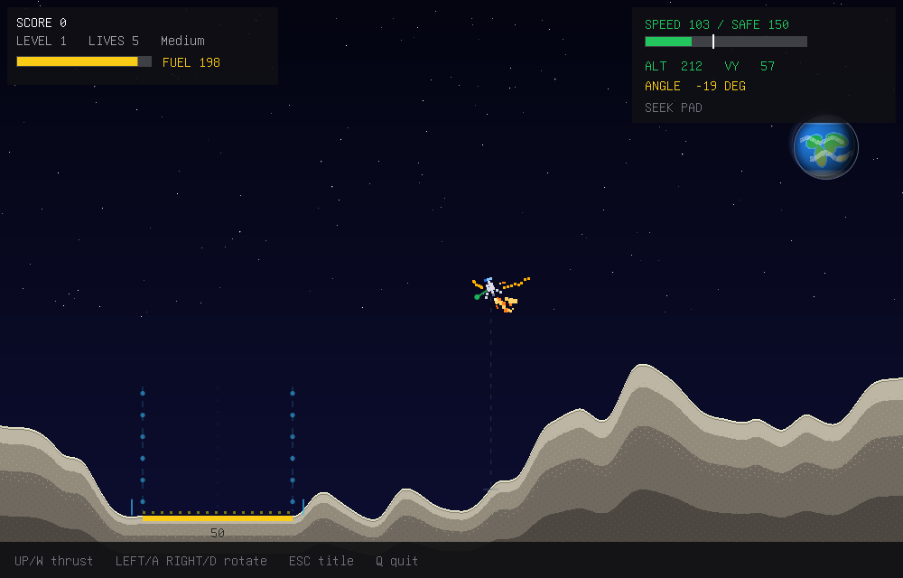

# Kilix Lander

Kitty-protocol Lunar Lander in C: a software-rendered RGBA framebuffer,
zlib/base64 kitty graphics, exact press/release keyboard input, banked physical
sound effects, and a fixed-timestep game loop.

It follows the Bashed Earth terminal-rendering style while turning the Python
`terminal_lander.py` prototype into a native retro arcade game with lunar
terrain, flat scoring pads, fuel, lives, level progression, altitude warnings,
landing tolerances, and crash particles.

Built for Linux and kitty-protocol terminals such as kitty, ghostty, and
wezterm.



The executable remains `terminal-lander` for compatibility with existing Kilix
installations and scripts.

## Features

- **Four difficulty presets** - Easy, Medium, Hard, and Extra Hard, with
  Extra Hard preserving the original prototype tuning
- **Neural pilot** - an 870-parameter network trained in the game's own
  simulation lands 98.4% of held-out levels 1-60 (the scripted autopilot:
  55%). Pick it on the menu to watch, press N to take over mid-flight, and
  press N again to hand back
- **Menus** - a main menu (start, difficulty, pilot, controls, quit), a pause
  menu (resume, restart level, main menu, quit) and a game-over menu
- **Assistive flight model** - lower presets add more fuel, wider pads,
  softer limits, stronger damping, and control stabilization
- **Retro software renderer** - pixel-art lander, stars, Earth backdrop,
  layered lunar terrain, HUD panels, pad guides, particles, and screen shake
- **Banked spacecraft sound** - three seamless variants for each thruster plus
  physical crash, touchdown, warning, confirmation, and menu cues; the original
  procedural synthesizer remains as a missing-asset fallback
- **Terminal-native presentation** - no SDL, no X11, no ncurses; frames are
  compressed and streamed through the kitty graphics protocol
- **Independent held controls** - Kitty keyboard press and release events keep
  simultaneous main and side thrust responsive, with a press-only fallback
  for terminals that do not report releases
- **Headless checks** - deterministic selftest and render-test modes for CI

## Build

Linux only. Needs gcc or clang, zlib, libm, pthreads, and a terminal that
supports the kitty graphics protocol:

```sh
make
./terminal-lander
```

Sound plays through the first available CLI sink (`pacat`, `pw-play`,
`aplay`, or sox's `play`). If no sink is found, the game runs silently.

## Controls

| Key | Action |
|-----|--------|
| Up / W | main thrust; in a menu, move up |
| Left / A | rotate left + side thrust; on the main menu, change a setting |
| Right / D | rotate right + side thrust; on the main menu, change a setting |
| Down / S | in a menu, move down |
| Enter / Space | choose a menu item, advance after a landing |
| Esc / P | pause menu during flight |
| N | in flight with a computer pilot chosen: take the controls, or hand them back |
| 1-4 on the main menu | Easy / Medium / Hard / Extra Hard |
| C | controls screen |

The game is left through QUIT on the main, pause or game-over menu; Ctrl+C
also exits. Difficulty presets change fuel, lives, pad width, terrain
roughness, landing tolerance, damping, and control assistance.

## Neural pilot

The PILOT setting chooses who flies: You, Neural (the trained network), or
Autopilot (the game's scripted pilot). The network sees 30 screen-independent
features: the lander, the pad, the terrain around it, the screen edges and
the difficulty's physics. It picks main thrust and side thrust 60 times a
second. It was trained with evolution strategies, directly on landing, in
this game's simulation. Nothing third-party went into it. See
[tools/neural/README.md](tools/neural/README.md) and
[docs/neural-policy-provenance.json](docs/neural-policy-provenance.json).

Held-out levels (8,000, evaluated once): levels 1-60, all four difficulties,
ten terminal sizes from 800x500 to 3840x2160:

| Difficulty | Neural | Autopilot |
|---|---|---|
| Easy | 100% | 95.1% |
| Medium | 100% | 68.7% |
| Hard | 99.9% | 44.3% |
| Extra Hard | 93.6% | 11.8% |
| **All** | **98.4%** | **55.0%** |

## Development

```sh
make test                              # deterministic headless checks
./terminal-lander --selftest 42 3600   # specific seed and tick count
./terminal-lander --render-test 7 DIR  # dump render_*.ppm screenshots into DIR
./terminal-lander --pilot-test         # neural pilot vs the autopilot, 800 levels
./terminal-lander --menu-test          # menus, pause, hand-over
make lab                               # the neural pilot lab (tools/neural)
./terminal-lander --sound-test
```

`TERMINAL_LANDER_ASSETS=/path/to/assets` overrides runtime asset discovery for
packaging and installed-layout tests.

## Architecture

| File | Role |
|------|------|
| `src/term.c` | Kitty keyboard events, compatibility input, thin adapter over the kitty-framebuffer presenter |
| `src/game.c` | lander physics, terrain generation, pads, particles, difficulty, scoring, menus, pilot features |
| `src/pilot.c` | the compiled-in neural pilot (kilix_game_policy) and the per-tick hand-over |
| `src/render.c` | scene, HUD, and menu drawing over the soft-raster primitives |
| `src/sound.c` | strict PCM WAV banks, procedural fallback synthesis, playback through the pcm-mixer voices |
| `src/main.c` | interactive loop, selftest, render-test, sound-test |

Shared infrastructure is vendored under `third_party/`:

| Library | Role |
|---------|------|
| `third_party/kitty-framebuffer` | zlib + base64 kitty graphics presenter thread, raw mode, restore sequences |
| `third_party/soft-raster` | anti-aliased software rasterizer with the embedded 8x16 PSF font |
| `third_party/pcm-mixer` | CLI-sink audio transport, voice mixer, strict WAV loader |
| `third_party/kitty_keyboard` | kitty keyboard protocol decoding with press/release state |

## License

Code and the 21 WAVs in `assets/sfx/` are MIT licensed; see [LICENSE](LICENSE).
The audio is rendered locally from procedural synthesis and CC0/public-domain
recordings, and no ElevenLabs material remains. Full source details and
artifact hashes are in [asset provenance](docs/asset-sources.md). The embedded
terminal font comes from Debian console-setup's public-domain console fonts;
details are preserved in `third_party/soft-raster/src/font8x16.h`.
